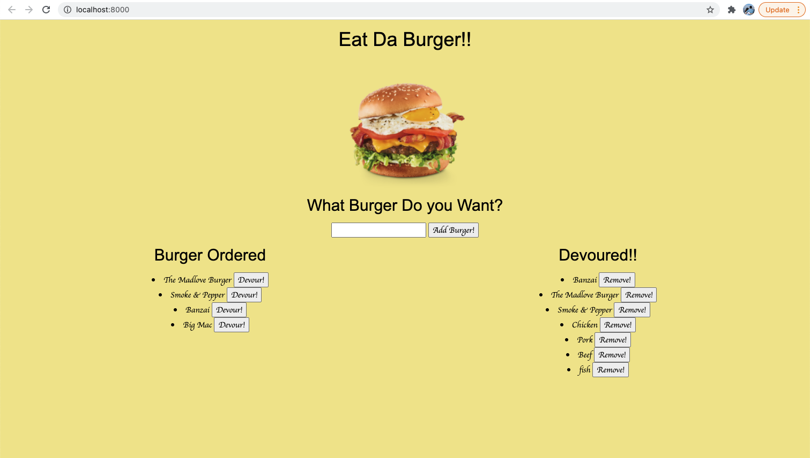

# TN-Berger-Application

# Table Content
- [Description](#Description)
- [User Story](#User-Story)
- [Application Usage](#Application-Usage)
- [Link](#Link)
- [Screenshot](#Screenshot)

## Description
In this assignment, you'll create a burger logger with MySQL, Node, Express, Handlebars and a homemade ORM (yum!). Be sure to follow the MVC design pattern; use Node and MySQL to query and route data in your app, and Handlebars to generate your HTML.

## User Story
   As User, I want a webpage to add my favorite burger that I order, then I can more my Burger to Devoured list to mark that I already ate it. Then I can remove Devoured Burber.

## Application Usage
* Express
* Express Handlebars
* Mysql
* ORM
* Heroku

## Link
* [Deployed Link](https://tn-eat-da-burger.herokuapp.com/)
* [Repo Link](https://github.com/trucn0215/TN-Berger-Application)

## Screenshot
